# System Design — منصة إدارة أدوار الأخصائيين

> **Specialist Role Management Platform**
> Version 1.0 | Multi-Tenant SaaS | RTL-First | Arabic UI
>
> *Architecture Decisions · Security · Scalability · Operations*

---

## Table of Contents

1. [Architecture Overview](#1-architecture-overview)
2. [C4 Model](#2-c4-model)
3. [Tech Stack & Rationale](#3-tech-stack--rationale)
4. [Backend Deep Dive](#4-backend-deep-dive)
5. [Frontend Deep Dive](#5-frontend-deep-dive)
6. [Authentication & RBAC](#6-authentication--rbac)
7. [Database Design](#7-database-design)
8. [Security Model](#8-security-model)
9. [API Design](#9-api-design)
10. [Deployment & DevOps](#10-deployment--devops)
11. [Observability](#11-observability)
12. [Testing Strategy](#12-testing-strategy)
13. [Scalability & Performance](#13-scalability--performance)
14. [ADR Log](#14-adr-log)

---

## 1. Architecture Overview

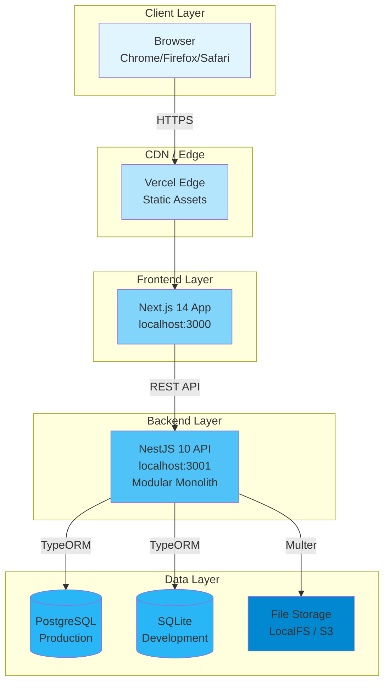

### Request Lifecycle

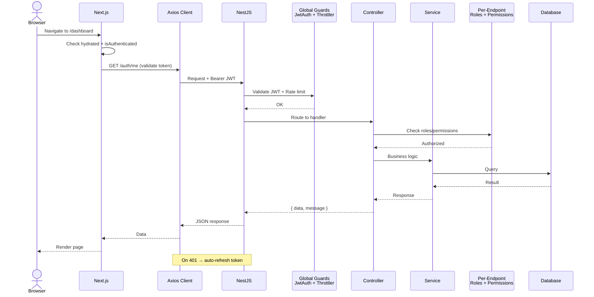

---

## 2. C4 Model

### Level 1: System Context

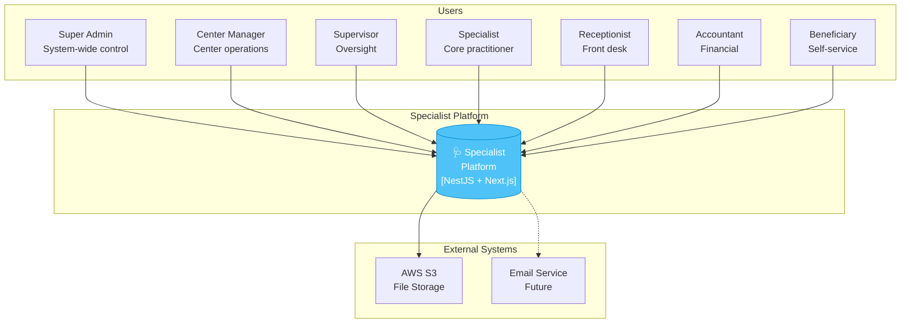

### Level 2: Container Diagram

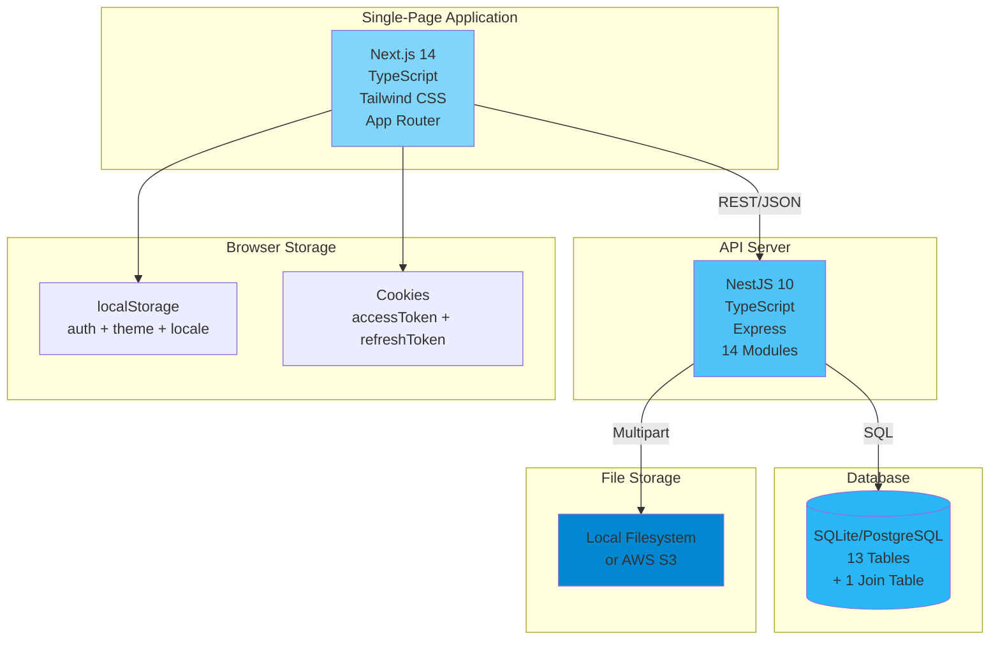

### Level 3: Component Diagram (Backend)

```mermaid
graph TB
    subgraph "Common Layer"
        DEC[Decorators<br/>@Public @AdminOnly<br/>@WriterOnly @AllRoles<br/>@CurrentUser @TenantId]
        GRD[Guards<br/>JwtAuthGuard<br/>TenantGuard<br/>RbacGuard<br/>RolesGuard<br/>PermissionGuard]
        PERM[Permissions<br/>48 Permissions<br/>7 Role Matrix<br/>roleHasPermission()]
        FLT[GlobalExceptionFilter<br/>Normalize errors]
        INT[ResponseInterceptor<br/>Wrap { success, data }]
    end

    subgraph "Auth Module"
        AUTH[AuthController<br/>8 endpoints]
        AUTH_SVC[AuthService<br/>login / refresh / profile]
        JWT[JwtStrategy<br/>Passport JWT]
        PWD[PasswordResetToken<br/>Entity]
    end

    subgraph "Users Module"
        USR[UsersController<br/>6 endpoints]
        USR_SVC[UsersService<br/>CRUD + toggleActive]
        USR_E[User Entity<br/>7 roles]
    end

    subgraph "Tenants Module"
        TNT[TenantsController<br/>7 endpoints]
        TNT_E[Tenant Entity<br/>Multi-tenant root]
    end

    subgraph "Beneficiaries Module"
        BEN[BeneficiariesController<br/>12 endpoints]
        BEN_SVC[BeneficiariesService]
        BEN_E[Beneficiary Entity<br/>+ BeneficiaryFile]
    end

    subgraph "Payments Module"
        PAY[PaymentsController<br/>14 endpoints]
        PKG[ServicePackage]
        SUB[Subscription]
        INV[Invoice]
    end

    subgraph "Analytics & Search"
        ANL[AnalyticsController<br/>4 endpoints]
        SRCH[SearchController<br/>2 endpoints]
    end

    DEC --> GRD
    GRD --> PERM
    AUTH --> AUTH_SVC
    AUTH_SVC --> USR_E
    USR --> USR_SVC
    USR_SVC --> USR_E
    BEN --> BEN_SVC
    BEN_SVC --> BEN_E
    PAY --> PKG
    PAY --> SUB
    PAY --> INV

    style DEC fill:#e1f5fe
    style GRD fill:#b3e5fc
    style PERM fill:#81d4fa
    style FLT fill:#ffccbc
    style INT fill:#c8e6c9
```

### Level 4: Code Diagram — RBAC Flow

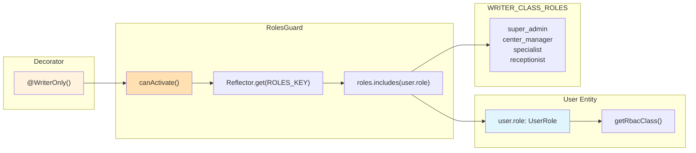

---

## 3. Tech Stack & Rationale

| Layer | Choice | Why Not X? |
|-------|--------|-------------|
| **Frontend Framework** | Next.js 14 App Router | Remix: simpler data loading but less ecosystem. Vite: no SSR needed now but will need later |
| **State (Client)** | Zustand | Redux: boilerplate-heavy. Jotai/Recoil: overkill for single store |
| **State (Server)** | TanStack React Query | SWR: fewer features. RTK Query: tied to Redux |
| **Backend Framework** | NestJS 10 | Express: no structure. Fastify: less ecosystem. Django: Python ecosystem mismatch |
| **ORM** | TypeORM 0.3 | Prisma: generates types but less control over queries. MikroORM: smaller community |
| **Validation** | class-validator | Zod backend: NestJS integrates natively with class-validator |
| **Auth** | Passport JWT + bcrypt(12) | Auth0: vendor lock-in. Firebase: too heavy. Magic Links: overengineered |
| **Database** | PostgreSQL / SQLite | MySQL: less JSON support. MariaDB: same. SQLite: perfect for dev |
| **CSS** | Tailwind CSS 3.4 | Styled-components: runtime cost. CSS Modules: no design system. Sass: no utility system |
| **i18n** | Custom Context + JSON | next-intl: extra dependency. react-i18next: heavy. This is simpler |
| **File Upload** | Multer + LocalFS/S3 | Uploadthing: vendor lock-in. Busboy: low-level |

### Key Version Constraints

```json
{
  "node": ">=18.17",
  "next": "14.2.4",
  "react": "18.3",
  "tailwindcss": "3.4",
  "typescript": ">=5.3",
  "typeorm": "0.3.19",
  "@nestjs/core": "10.3"
}
```

---

## 4. Backend Deep Dive

### 4.1 Module Dependency Graph

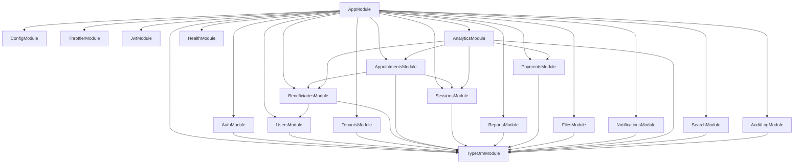

### 4.2 Entity Relationship (Full)

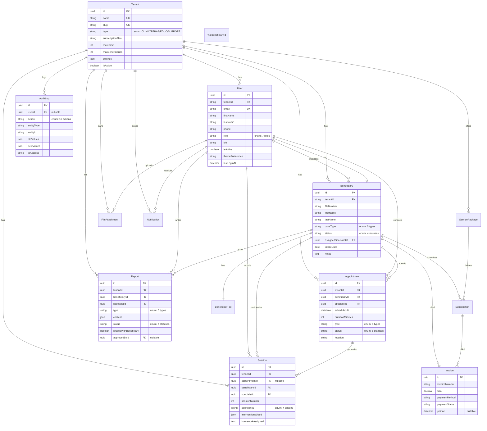

### 4.3 Guard Stack — Per Controller

| Controller | Guard Chain | Exception |
|-----------|-------------|-----------|
| `AuthController` | `@SkipRbac()` | `@Public()` on login/refresh/reset |
| `UsersController` | `JwtAuthGuard, TenantGuard, RbacGuard` | – |
| `TenantsController` | `JwtAuthGuard, RbacGuard, RolesGuard` | No `TenantGuard` (admin-only) |
| `BeneficiariesController` | `JwtAuthGuard, TenantGuard, RbacGuard` | – |
| `AppointmentsController` | `JwtAuthGuard, TenantGuard, RbacGuard` | – |
| `SessionsController` | `JwtAuthGuard, TenantGuard, RbacGuard` | – |
| `ReportsController` | `JwtAuthGuard, TenantGuard, RbacGuard` | – |
| `PaymentsController` | `JwtAuthGuard, TenantGuard, RbacGuard` | – |
| `FilesController` | `JwtAuthGuard, TenantGuard, RbacGuard` | – |
| `NotificationsController` | `JwtAuthGuard, TenantGuard` | No `RbacGuard` |
| `SearchController` | `JwtAuthGuard, TenantGuard` | No `RbacGuard` |
| `AnalyticsController` | `JwtAuthGuard, TenantGuard, RbacGuard` | – |
| `AuditLogController` | `JwtAuthGuard, TenantGuard` | No `RbacGuard` |
| `HealthController` | `@Public()` | No guards |

### 4.4 RBAC Classification

```typescript
// From user.entity.ts
const ADMIN_CLASS_ROLES  = [SUPER_ADMIN, CENTER_MANAGER, SUPERVISOR];
const WRITER_CLASS_ROLES = [SUPER_ADMIN, CENTER_MANAGER, SPECIALIST, RECEPTIONIST];
const WRITE_BYPASS_ROLES = [SUPER_ADMIN, CENTER_MANAGER, SUPERVISOR, ACCOUNTANT];
const BENEFICIARY_ROLES  = [BENEFICIARY];

enum RbacClass { ADMIN = 'admin', WRITER = 'writer', BENEFICIARY = 'beneficiary' }

function getRbacClass(role: UserRole): RbacClass {
  if (ADMIN_CLASS_ROLES.includes(role)) return RbacClass.ADMIN;
  if (WRITER_CLASS_ROLES.includes(role)) return RbacClass.WRITER;
  return RbacClass.BENEFICIARY;
}
```

---

## 5. Frontend Deep Dive

### 5.1 Component Tree

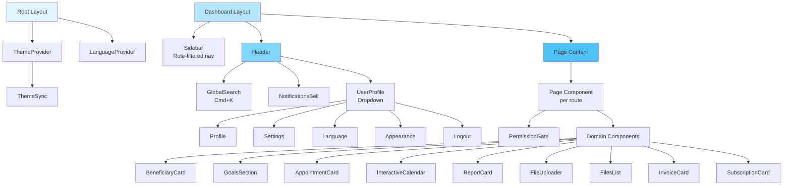

### 5.2 State Architecture

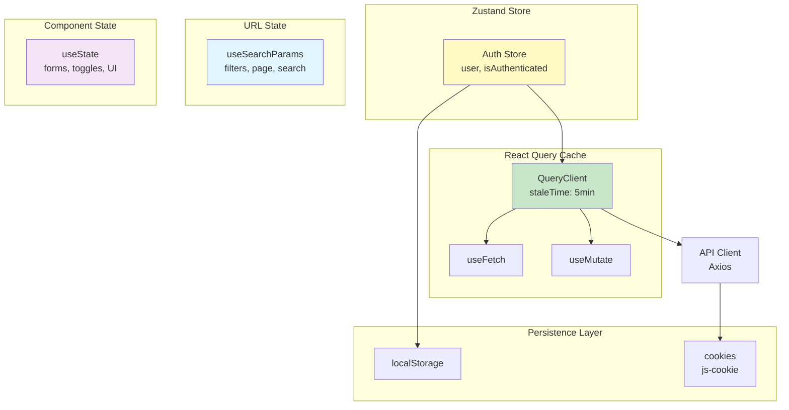

### 5.3 Route Map — Roles Matrix

| Route | super_admin | center_manager | supervisor | specialist | receptionist | accountant | beneficiary |
|-------|:-----------:|:--------------:|:----------:|:----------:|:------------:|:----------:|:-----------:|
| `/dashboard` | ✅ | ✅ | ✅ | ✅ | ✅ | ✅ | ❌ |
| `/search` | ✅ | ✅ | ✅ | ✅ | ✅ | ❌ | ❌ |
| `/specialists` | ✅ | ✅ | ✅ | ❌ | ❌ | ❌ | ❌ |
| `/beneficiaries` | ✅ | ✅ | ✅ | ✅ | ✅ | ❌ | ❌ |
| `/appointments` | ✅ | ✅ | ✅ | ✅ | ✅ | ❌ | ❌ |
| `/reports` | ✅ | ✅ | ✅ | ✅ | ❌ | ✅ | ❌ |
| `/payments` | ✅ | ✅ | ❌ | ❌ | ❌ | ✅ | ❌ |
| `/files` | ✅ | ✅ | ✅ | ✅ | ❌ | ❌ | ❌ |
| `/users` | ✅ | ✅ | ❌ | ❌ | ❌ | ❌ | ❌ |
| `/analytics` | ✅ | ✅ | ✅ | ❌ | ❌ | ✅ | ❌ |
| `/audit` | ✅ | ✅ | ❌ | ❌ | ❌ | ❌ | ❌ |
| `/profile` | ✅ | ✅ | ✅ | ✅ | ✅ | ✅ | ❌ |
| `/settings` | ✅ | ✅ | ✅ | ✅ | ✅ | ✅ | ❌ |
| `/notifications` | ✅ | ✅ | ✅ | ✅ | ✅ | ✅ | ❌ |

### 5.4 Performance Budget

| Metric | Target | Current (approx) |
|--------|--------|------------------|
| Time to First Byte (TTFB) | <200ms | ~50ms (dev) |
| First Contentful Paint | <1.5s | Immediate (CSR) |
| Time to Interactive | <3s | ~500ms |
| Bundle Size (JS) | <500KB | ~400KB |
| API Response Time (p95) | <300ms | ~100ms |
| Lighthouse Performance | >90 | N/A (CSR) |
| Lighthouse Accessibility | >95 | ~95 |

---

## 6. Authentication & RBAC

### 6.1 Login Flow

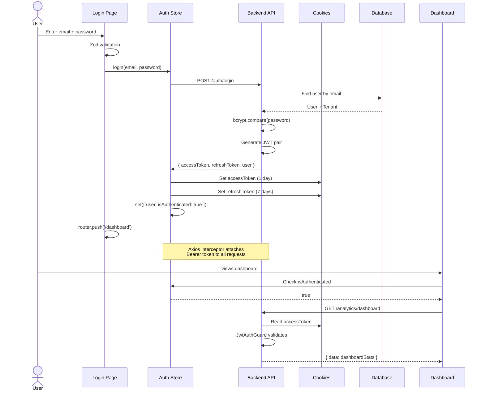

### 6.2 Token Refresh Flow

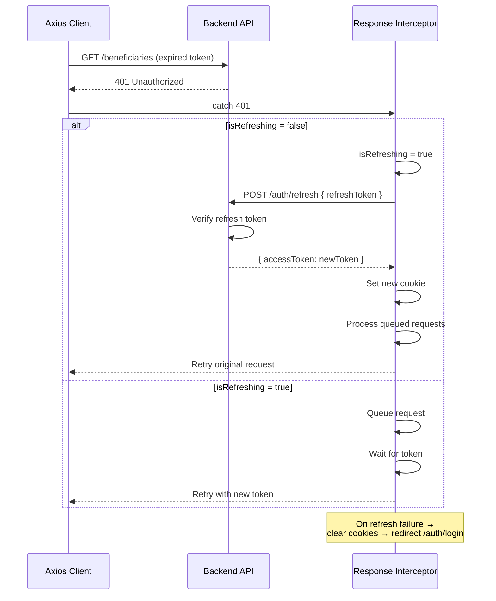

### 6.3 RBAC Decision Tree

```mermaid
graph TD
    REQ[HTTP Request] --> JWT{JwtAuthGuard}
    JWT -->|No token| 401[401 Unauthorized]
    JWT -->|Invalid| 401
    JWT -->|Valid| THR{ThrottlerGuard}
    THR -->|Rate exceeded| 429[429 Too Many]
    THR -->|OK| TENANT{TenantGuard}
    TENANT -->|Super Admin| RBAC_START
    TENANT -->|No tenantId| 403[403 Forbidden]
    TENANT -->|Has tenantId| RBAC_START

    RBAC_START{RbacGuard}
    RBAC_START -->|@SkipRbac| HANDLER[Route Handler]
    RBAC_START -->|admin class| ADMIN_CHECK{Is write?<br/>POST/PUT/PATCH/DEL?}
    ADMIN_CHECK -->|Yes| 403
    ADMIN_CHECK -->|No| HANDLER

    RBAC_START -->|writer class| WRITER_CHECK{Own data?}
    WRITER_CHECK -->|Yes| HANDLER
    WRITER_CHECK -->|No| HANDLER

    RBAC_START -->|beneficiary| BEN_CHECK{Is /me or /auth?}
    BEN_CHECK -->|Yes| HANDLER
    BEN_CHECK -->|No| 403

    HANDLER --> PERM{RolesGuard + PermissionGuard}
    PERM -->|@AdminOnly + isAdmin| SERVICE[Service Layer]
    PERM -->|@WriterOnly + isWriter| SERVICE
    PERM -->|@AllRoles + hasRole| SERVICE
    PERM -->|@RequirePermissions + hasPerm| SERVICE
    PERM -->|No match| 403

    SERVICE --> DB[(Database)]
    DB --> RESP[JSON Response]
```

### 6.4 Permission Matrix (Complete)

| Permission | super_admin | center_manager | supervisor | specialist | receptionist | accountant | beneficiary |
|-----------|:-----------:|:--------------:|:----------:|:----------:|:------------:|:----------:|:-----------:|
| `dashboard:view` | ✅ | ✅ | ✅ | ✅ | ✅ | ✅ | ❌ |
| `dashboard:stats` | ✅ | ✅ | ✅ | ✅ | ✅ | ✅ | ❌ |
| `dashboard:performance` | ✅ | ✅ | ✅ | ❌ | ❌ | ✅ | ❌ |
| `beneficiary:view_all` | ✅ | ✅ | ✅ | ❌ | ✅ | ✅ | ❌ |
| `beneficiary:view_own` | ✅ | ✅ | ❌ | ✅ | ❌ | ❌ | ❌ |
| `beneficiary:view_self` | ❌ | ❌ | ❌ | ❌ | ❌ | ❌ | ✅ |
| `beneficiary:create` | ✅ | ✅ | ❌ | ✅ | ✅ | ❌ | ❌ |
| `beneficiary:update` | ✅ | ✅ | ❌ | ✅ | ✅ | ❌ | ❌ |
| `beneficiary:archive` | ✅ | ✅ | ❌ | ✅ | ✅ | ❌ | ❌ |
| `beneficiary:assign` | ✅ | ✅ | ❌ | ✅ | ❌ | ❌ | ❌ |
| `appointment:view_all` | ✅ | ✅ | ✅ | ❌ | ✅ | ❌ | ❌ |
| `appointment:view_own` | ✅ | ✅ | ❌ | ✅ | ❌ | ❌ | ❌ |
| `appointment:view_self` | ❌ | ❌ | ❌ | ❌ | ❌ | ❌ | ✅ |
| `appointment:create` | ✅ | ✅ | ❌ | ✅ | ✅ | ❌ | ❌ |
| `appointment:update` | ✅ | ✅ | ❌ | ✅ | ✅ | ❌ | ❌ |
| `appointment:cancel` | ✅ | ✅ | ❌ | ✅ | ✅ | ❌ | ❌ |
| `appointment:confirm` | ✅ | ✅ | ❌ | ✅ | ✅ | ❌ | ❌ |
| `session:view_all` | ✅ | ✅ | ✅ | ❌ | ❌ | ❌ | ❌ |
| `session:view_own` | ✅ | ✅ | ❌ | ✅ | ❌ | ❌ | ❌ |
| `session:create` | ✅ | ✅ | ❌ | ✅ | ❌ | ❌ | ❌ |
| `session:update` | ✅ | ✅ | ❌ | ✅ | ❌ | ❌ | ❌ |
| `session:confirm_attend` | ✅ | ✅ | ❌ | ✅ | ✅ | ❌ | ❌ |
| `report:view_all` | ✅ | ✅ | ✅ | ❌ | ❌ | ✅ | ❌ |
| `report:view_own` | ✅ | ✅ | ❌ | ✅ | ❌ | ❌ | ❌ |
| `report:view_shared` | ✅ | ✅ | ✅ | ✅ | ❌ | ✅ | ✅ |
| `report:create` | ✅ | ✅ | ❌ | ✅ | ❌ | ❌ | ❌ |
| `report:update` | ✅ | ✅ | ❌ | ✅ | ❌ | ❌ | ❌ |
| `report:approve` | ✅ | ✅ | ✅ | ❌ | ❌ | ❌ | ❌ |
| `report:export` | ✅ | ✅ | ✅ | ❌ | ❌ | ✅ | ❌ |
| `payment:view` | ✅ | ✅ | ✅ | ❌ | ❌ | ✅ | ❌ |
| `payment:create` | ✅ | ✅ | ❌ | ❌ | ❌ | ✅ | ❌ |
| `payment:update` | ✅ | ✅ | ❌ | ❌ | ❌ | ✅ | ❌ |
| `user:view` | ✅ | ✅ | ❌ | ❌ | ❌ | ❌ | ❌ |
| `user:create` | ✅ | ❌ | ❌ | ❌ | ❌ | ❌ | ❌ |
| `user:update` | ✅ | ❌ | ❌ | ✅ | ✅ | ❌ | ❌ |
| `user:deactivate` | ✅ | ❌ | ❌ | ✅ | ✅ | ❌ | ❌ |
| `file:view` | ✅ | ✅ | ✅ | ✅ | ❌ | ❌ | ❌ |
| `file:view_self` | ✅ | ✅ | ❌ | ❌ | ❌ | ❌ | ✅ |
| `file:update` | ✅ | ✅ | ❌ | ✅ | ❌ | ❌ | ❌ |
| `tenant:view` | ✅ | ✅ | ❌ | ❌ | ❌ | ❌ | ❌ |
| `tenant:manage` | ✅ | ❌ | ❌ | ❌ | ❌ | ❌ | ❌ |
| `profile:view_self` | ✅ | ✅ | ✅ | ✅ | ✅ | ✅ | ✅ |
| `profile:update_self` | ✅ | ✅ | ✅ | ✅ | ✅ | ✅ | ✅ |
| `notification:view` | ✅ | ✅ | ✅ | ✅ | ✅ | ✅ | ✅ |
| `audit:view` | ✅ | ✅ | ❌ | ❌ | ❌ | ❌ | ❌ |

---

## 7. Database Design

### 7.1 Schema Overview (All 14 Tables)

```sql
-- ============================================================
-- BASE: All entities extend AbstractEntity
-- ============================================================
-- CREATE TABLE abstract_entities (
--     id          UUID PRIMARY KEY DEFAULT gen_random_uuid(),
--     created_at  TIMESTAMP DEFAULT CURRENT_TIMESTAMP,
--     updated_at  TIMESTAMP DEFAULT CURRENT_TIMESTAMP
-- );

-- ============================================================
-- TENANTS (Root multi-tenant entity)
-- ============================================================
CREATE TABLE tenants (
    id                      UUID PRIMARY KEY DEFAULT gen_random_uuid(),
    created_at              TIMESTAMP DEFAULT CURRENT_TIMESTAMP,
    updated_at              TIMESTAMP DEFAULT CURRENT_TIMESTAMP,
    name                    VARCHAR(255) NOT NULL UNIQUE,
    slug                    VARCHAR(100) NOT NULL UNIQUE,
    type                    VARCHAR(50) NOT NULL CHECK (type IN ('CLINIC','REHABILITATION','EDUCATIONAL','SUPPORT')),
    subscription_plan       VARCHAR(50) DEFAULT 'BASIC' CHECK (subscription_plan IN ('BASIC','PROFESSIONAL','ENTERPRISE')),
    subscription_expires_at TIMESTAMP,
    max_users               INTEGER DEFAULT 10,
    max_beneficiaries       INTEGER DEFAULT 100,
    settings                JSON DEFAULT '{}',
    logo_url                VARCHAR(500),
    address                 TEXT,
    phone                   VARCHAR(20),
    email                   VARCHAR(255),
    is_active               BOOLEAN DEFAULT TRUE
);

-- ============================================================
-- USERS
-- ============================================================
CREATE TABLE users (
    id                UUID PRIMARY KEY DEFAULT gen_random_uuid(),
    created_at        TIMESTAMP DEFAULT CURRENT_TIMESTAMP,
    updated_at        TIMESTAMP DEFAULT CURRENT_TIMESTAMP,
    tenant_id         UUID REFERENCES tenants(id) ON DELETE SET NULL,
    email             VARCHAR(255) NOT NULL UNIQUE,
    password_hash     VARCHAR(255) NOT NULL,
    first_name        VARCHAR(50) NOT NULL,
    last_name         VARCHAR(50) NOT NULL,
    phone             VARCHAR(20),
    avatar_url        VARCHAR(500),
    bio               TEXT,
    role              VARCHAR(20) NOT NULL CHECK (role IN (
                          'super_admin','center_manager','supervisor',
                          'specialist','receptionist','accountant','beneficiary'
                      )),
    beneficiary_id    UUID,
    is_active         BOOLEAN DEFAULT TRUE,
    theme_preference  VARCHAR(10) DEFAULT 'system',
    last_login_at     TIMESTAMP
);

-- ============================================================
-- BENEFICIARIES
-- ============================================================
CREATE TABLE beneficiaries (
    id                      UUID PRIMARY KEY DEFAULT gen_random_uuid(),
    created_at              TIMESTAMP DEFAULT CURRENT_TIMESTAMP,
    updated_at              TIMESTAMP DEFAULT CURRENT_TIMESTAMP,
    tenant_id               UUID REFERENCES tenants(id),
    file_number             VARCHAR(50),
    first_name              VARCHAR(50) NOT NULL,
    last_name               VARCHAR(50) NOT NULL,
    date_of_birth           DATE,
    gender                  VARCHAR(10) CHECK (gender IN ('MALE','FEMALE')),
    national_id             VARCHAR(50),
    phone                   VARCHAR(20),
    email                   VARCHAR(255),
    address                 TEXT,
    guardian_name           VARCHAR(100),
    guardian_phone          VARCHAR(20),
    guardian_relationship   VARCHAR(50),
    referral_source         VARCHAR(20) CHECK (referral_source IN ('SELF','HOSPITAL','SCHOOL','OTHER')),
    case_type               VARCHAR(20) CHECK (case_type IN (
                                'PSYCHOLOGICAL','EDUCATIONAL','SPEECH','OCCUPATIONAL','SOCIAL'
                            )),
    status                  VARCHAR(20) DEFAULT 'ACTIVE' CHECK (status IN (
                                'ACTIVE','INACTIVE','COMPLETED','ARCHIVED'
                            )),
    assigned_specialist_id  UUID REFERENCES users(id),
    intake_date             DATE,
    notes                   TEXT,
    created_by_id           UUID REFERENCES users(id)
);

-- ============================================================
-- BENEFICIARY FILES
-- ============================================================
CREATE TABLE beneficiary_files (
    id                      UUID PRIMARY KEY DEFAULT gen_random_uuid(),
    created_at              TIMESTAMP DEFAULT CURRENT_TIMESTAMP,
    updated_at              TIMESTAMP DEFAULT CURRENT_TIMESTAMP,
    beneficiary_id          UUID UNIQUE REFERENCES beneficiaries(id),
    tenant_id               UUID REFERENCES tenants(id),
    diagnosis               JSON DEFAULT '[]',
    medical_history         TEXT,
    educational_history     TEXT,
    family_history          TEXT,
    assessment_results      JSON DEFAULT '{}',
    goals                   JSON DEFAULT '[]',
    created_by_id           UUID REFERENCES users(id)
);

-- ============================================================
-- APPOINTMENTS
-- ============================================================
CREATE TABLE appointments (
    id                  UUID PRIMARY KEY DEFAULT gen_random_uuid(),
    created_at          TIMESTAMP DEFAULT CURRENT_TIMESTAMP,
    updated_at          TIMESTAMP DEFAULT CURRENT_TIMESTAMP,
    tenant_id           UUID REFERENCES tenants(id),
    beneficiary_id      UUID REFERENCES beneficiaries(id),
    specialist_id       UUID REFERENCES users(id),
    scheduled_at        TIMESTAMP NOT NULL,
    duration_minutes    INTEGER DEFAULT 60,
    type                VARCHAR(20) CHECK (type IN ('INITIAL','FOLLOW_UP','ASSESSMENT','GROUP')),
    status              VARCHAR(20) DEFAULT 'SCHEDULED' CHECK (status IN (
                            'SCHEDULED','CONFIRMED','COMPLETED','CANCELLED','NO_SHOW'
                        )),
    location            VARCHAR(255),
    notes               TEXT,
    cancellation_reason TEXT,
    reminder_sent_at    TIMESTAMP,
    created_by_id       UUID REFERENCES users(id)
);

-- ============================================================
-- SESSIONS
-- ============================================================
CREATE TABLE sessions (
    id                      UUID PRIMARY KEY DEFAULT gen_random_uuid(),
    created_at              TIMESTAMP DEFAULT CURRENT_TIMESTAMP,
    updated_at              TIMESTAMP DEFAULT CURRENT_TIMESTAMP,
    tenant_id               UUID REFERENCES tenants(id),
    appointment_id          UUID REFERENCES appointments(id),
    beneficiary_id          UUID REFERENCES beneficiaries(id),
    specialist_id           UUID REFERENCES users(id),
    session_number          INTEGER DEFAULT 1,
    started_at              TIMESTAMP,
    ended_at                TIMESTAMP,
    actual_duration_minutes INTEGER,
    attendance              VARCHAR(10) CHECK (attendance IN ('PRESENT','ABSENT','LATE','EXCUSED')),
    mood_assessment         SMALLINT CHECK (mood_assessment BETWEEN 1 AND 10),
    objectives_met          BOOLEAN,
    session_notes           TEXT,
    interventions_used      JSON DEFAULT '[]',
    homework_assigned       TEXT,
    next_session_plan       TEXT
);

-- ============================================================
-- REPORTS
-- ============================================================
CREATE TABLE reports (
    id                      UUID PRIMARY KEY DEFAULT gen_random_uuid(),
    created_at              TIMESTAMP DEFAULT CURRENT_TIMESTAMP,
    updated_at              TIMESTAMP DEFAULT CURRENT_TIMESTAMP,
    tenant_id               UUID REFERENCES tenants(id),
    beneficiary_id          UUID REFERENCES beneficiaries(id),
    specialist_id           UUID REFERENCES users(id),
    type                    VARCHAR(30) NOT NULL CHECK (type IN (
                                'INITIAL_ASSESSMENT','PROGRESS','PERIODIC','FINAL','REFERRAL'
                            )),
    title                   VARCHAR(255) NOT NULL,
    period_from             DATE,
    period_to               DATE,
    content                 JSON NOT NULL DEFAULT '{}',
    recommendations         TEXT,
    status                  VARCHAR(20) DEFAULT 'DRAFT' CHECK (status IN (
                                'DRAFT','SUBMITTED','APPROVED','ARCHIVED'
                            )),
    shared_with_beneficiary BOOLEAN DEFAULT FALSE,
    approved_by_id          UUID REFERENCES users(id),
    approved_at             TIMESTAMP
);

-- ============================================================
-- SERVICE PACKAGES
-- ============================================================
CREATE TABLE service_packages (
    id                UUID PRIMARY KEY DEFAULT gen_random_uuid(),
    created_at        TIMESTAMP DEFAULT CURRENT_TIMESTAMP,
    updated_at        TIMESTAMP DEFAULT CURRENT_TIMESTAMP,
    tenant_id         UUID REFERENCES tenants(id),
    name              VARCHAR(255) NOT NULL,
    description       TEXT,
    sessions_count    INTEGER NOT NULL,
    price             DECIMAL(10,2) NOT NULL,
    validity_days     INTEGER DEFAULT 90,
    is_active         BOOLEAN DEFAULT TRUE
);

-- ============================================================
-- SUBSCRIPTIONS
-- ============================================================
CREATE TABLE subscriptions (
    id                  UUID PRIMARY KEY DEFAULT gen_random_uuid(),
    created_at          TIMESTAMP DEFAULT CURRENT_TIMESTAMP,
    updated_at          TIMESTAMP DEFAULT CURRENT_TIMESTAMP,
    tenant_id           UUID REFERENCES tenants(id),
    beneficiary_id      UUID REFERENCES beneficiaries(id),
    package_id          UUID REFERENCES service_packages(id),
    sessions_used       INTEGER DEFAULT 0,
    sessions_remaining  INTEGER,
    amount_paid         DECIMAL(10,2),
    discount_amount     DECIMAL(10,2) DEFAULT 0,
    start_date          DATE,
    expiry_date         DATE,
    status              VARCHAR(20) DEFAULT 'ACTIVE' CHECK (status IN (
                            'ACTIVE','EXPIRED','CANCELLED','COMPLETED'
                        )),
    created_by_id       UUID REFERENCES users(id)
);

-- ============================================================
-- INVOICES
-- ============================================================
CREATE TABLE invoices (
    id                  UUID PRIMARY KEY DEFAULT gen_random_uuid(),
    created_at          TIMESTAMP DEFAULT CURRENT_TIMESTAMP,
    updated_at          TIMESTAMP DEFAULT CURRENT_TIMESTAMP,
    tenant_id           UUID REFERENCES tenants(id),
    invoice_number      VARCHAR(50) NOT NULL,
    beneficiary_id      UUID REFERENCES beneficiaries(id),
    subscription_id     UUID REFERENCES subscriptions(id),
    amount              DECIMAL(10,2),
    discount            DECIMAL(10,2) DEFAULT 0,
    tax                 DECIMAL(10,2) DEFAULT 0,
    total               DECIMAL(10,2) NOT NULL,
    payment_method      VARCHAR(20) CHECK (payment_method IN ('CASH','CARD','TRANSFER','INSURANCE')),
    payment_status      VARCHAR(20) DEFAULT 'PENDING' CHECK (payment_status IN ('PENDING','PAID','PARTIAL','REFUNDED')),
    paid_at             TIMESTAMP,
    notes               TEXT,
    created_by_id       UUID REFERENCES users(id)
);

-- ============================================================
-- FILE ATTACHMENTS (Polymorphic)
-- ============================================================
CREATE TABLE file_attachments (
    id                UUID PRIMARY KEY DEFAULT gen_random_uuid(),
    created_at        TIMESTAMP DEFAULT CURRENT_TIMESTAMP,
    updated_at        TIMESTAMP DEFAULT CURRENT_TIMESTAMP,
    tenant_id         UUID REFERENCES tenants(id),
    entity_type       VARCHAR(20) NOT NULL CHECK (entity_type IN ('BENEFICIARY','SESSION','REPORT','INVOICE')),
    entity_id         UUID NOT NULL,
    file_name         VARCHAR(255),
    file_path         VARCHAR(500) NOT NULL,
    file_size         BIGINT,
    mime_type         VARCHAR(100),
    original_name     VARCHAR(255),
    uploaded_by_id    UUID REFERENCES users(id)
);

-- ============================================================
-- NOTIFICATIONS
-- ============================================================
CREATE TABLE notifications (
    id          UUID PRIMARY KEY DEFAULT gen_random_uuid(),
    created_at  TIMESTAMP DEFAULT CURRENT_TIMESTAMP,
    updated_at  TIMESTAMP DEFAULT CURRENT_TIMESTAMP,
    tenant_id   UUID REFERENCES tenants(id),
    user_id     UUID REFERENCES users(id),
    type        VARCHAR(30) NOT NULL CHECK (type IN (
                    'APPOINTMENT_REMINDER','SESSION_DUE','REPORT_DUE','PAYMENT_DUE',
                    'REPORT_SUBMITTED','REPORT_APPROVED','NEW_BENEFICIARY',
                    'SUBSCRIPTION_EXPIRING','SYSTEM'
                )),
    title       VARCHAR(255) NOT NULL,
    message     TEXT,
    link        VARCHAR(500),
    is_read     BOOLEAN DEFAULT FALSE,
    read_at     TIMESTAMP
);

-- ============================================================
-- AUDIT LOGS
-- ============================================================
CREATE TABLE audit_logs (
    id            UUID PRIMARY KEY DEFAULT gen_random_uuid(),
    created_at    TIMESTAMP DEFAULT CURRENT_TIMESTAMP,
    updated_at    TIMESTAMP DEFAULT CURRENT_TIMESTAMP,
    tenant_id     UUID REFERENCES tenants(id),
    user_id       UUID REFERENCES users(id),
    action        VARCHAR(20) NOT NULL CHECK (action IN (
                      'CREATE','READ','UPDATE','DELETE','LOGIN','LOGOUT','EXPORT','APPROVE','SUBMIT'
                  )),
    entity_type   VARCHAR(50) NOT NULL,
    entity_id     VARCHAR(255),
    old_values    JSON,
    new_values    JSON,
    ip_address    VARCHAR(45),
    user_agent    TEXT,
    description   TEXT
);

-- ============================================================
-- PASSWORD RESET TOKENS
-- ============================================================
CREATE TABLE password_reset_tokens (
    id          UUID PRIMARY KEY DEFAULT gen_random_uuid(),
    created_at  TIMESTAMP DEFAULT CURRENT_TIMESTAMP,
    updated_at  TIMESTAMP DEFAULT CURRENT_TIMESTAMP,
    token       VARCHAR(255) NOT NULL UNIQUE,
    user_id     UUID REFERENCES users(id),
    expires_at  TIMESTAMP NOT NULL,
    used_at     TIMESTAMP,
    is_used     BOOLEAN DEFAULT FALSE
);
```

### 7.2 Index Strategy

```sql
-- ============================================================
-- PERFORMANCE INDEXES
-- ============================================================

-- Multi-tenant isolation (every query)
CREATE INDEX idx_users_tenant ON users(tenant_id);
CREATE INDEX idx_beneficiaries_tenant ON beneficiaries(tenant_id);
CREATE INDEX idx_appointments_tenant ON appointments(tenant_id);
CREATE INDEX idx_sessions_tenant ON sessions(tenant_id);
CREATE INDEX idx_reports_tenant ON reports(tenant_id);
CREATE INDEX idx_invoices_tenant ON invoices(tenant_id);

-- Common query paths
CREATE INDEX idx_beneficiaries_specialist ON beneficiaries(assigned_specialist_id);
CREATE INDEX idx_beneficiaries_status ON beneficiaries(status) WHERE status = 'ACTIVE';
CREATE INDEX idx_beneficiaries_case_type ON beneficiaries(case_type);
CREATE INDEX idx_beneficiaries_name ON beneficiaries(first_name, last_name);

CREATE INDEX idx_appointments_scheduled ON appointments(scheduled_at);
CREATE INDEX idx_appointments_specialist ON appointments(specialist_id);
CREATE INDEX idx_appointments_status ON appointments(status);
CREATE INDEX idx_appointments_date_status ON appointments(scheduled_at, status);

CREATE INDEX idx_sessions_beneficiary ON sessions(beneficiary_id);
CREATE INDEX idx_sessions_specialist ON sessions(specialist_id);

CREATE INDEX idx_reports_status ON reports(status);
CREATE INDEX idx_reports_specialist ON reports(specialist_id);
CREATE INDEX idx_reports_beneficiary ON reports(beneficiary_id);

CREATE INDEX idx_invoices_status ON invoices(payment_status);
CREATE INDEX idx_invoices_beneficiary ON invoices(beneficiary_id);
CREATE INDEX idx_invoices_number ON invoices(invoice_number);

CREATE INDEX idx_notifications_user ON notifications(user_id, is_read);
CREATE INDEX idx_notifications_type ON notifications(type);

CREATE INDEX idx_audit_logs_tenant ON audit_logs(tenant_id);
CREATE INDEX idx_audit_logs_action ON audit_logs(action);
CREATE INDEX idx_audit_logs_entity ON audit_logs(entity_type, entity_id);
CREATE INDEX idx_audit_logs_user ON audit_logs(user_id);
CREATE INDEX idx_audit_logs_date ON audit_logs(created_at);

CREATE INDEX idx_file_attachments_entity ON file_attachments(entity_type, entity_id);
CREATE INDEX idx_subscriptions_beneficiary ON subscriptions(beneficiary_id);
CREATE INDEX idx_subscriptions_status ON subscriptions(status);
```

### 7.3 JSON Column Schemas

```typescript
// beneficiary_files.diagnosis
interface DiagnosisItem {
  code?: string;      // ICD-10 or DSM-5 code
  name: string;       // Diagnosis name
  date: string;       // ISO date
  diagnosedBy?: string;
  notes?: string;
}

// beneficiary_files.goals
interface GoalItem {
  id: string;           // UUID
  description: string;
  targetDate?: string;  // ISO date
  status: 'pending' | 'in_progress' | 'achieved' | 'cancelled';
  notes?: string;
}

// sessions.interventions_used
type Intervention = string;  // e.g. "CBT", "Play Therapy", "Speech Exercises"

// reports.content
interface ReportContent {
  summary: string;
  currentStatus: string;
  goalsProgress: Array<{
    goalId: string;
    description: string;
    progress: string;
    status: string;
  }>;
  interventions: string[];
  challenges: string;
  achievements: string;
  behaviorChanges?: string;
  familyFeedback?: string;
  referralReason?: string;
  referralTo?: string;
  [key: string]: unknown;  // Extensible per report type
}

// tenants.settings
interface TenantSettings {
  locale?: 'ar' | 'en';
  defaultTheme?: 'light' | 'dark' | 'system';
  appointmentReminderHours?: number;
  sessionDurationDefault?: number;
  invoicePrefix?: string;
  notificationPreferences?: {
    email: boolean;
    sms: boolean;
    inApp: boolean;
  };
  [key: string]: unknown;
}
```

---

## 8. Security Model

### 8.1 STRIDE Threat Model

| Category | Threat | Mitigation |
|----------|--------|------------|
| **S**poofing | Attacker impersonates user | JWT + bcrypt(12) password hashing |
| **T**ampering | Modify data in transit | HTTPS (TLS 1.3) in production |
| **R**epudiation | User denies action | AuditLog tracks all CRUD + auth actions |
| **I**nformation Disclosure | Expose sensitive data | `@Exclude()` on passwordHash; tenant isolation; RBAC permissions |
| **D**enial of Service | Overload server | ThrottlerGuard (100 req/60s); rate limiting on auth endpoints |
| **E**levation of Privilege | User accesses unauthorized data | 3-layer RBAC (JWT → RbacGuard → PermissionGuard); tenantId filter |

### 8.2 Security Layers

```mermaid
graph TB
    subgraph "Layer 1: Network"
        L1_1[HTTPS / TLS 1.3]
        L1_2[CORS whitelist]
        L1_3[helmet headers]
    end

    subgraph "Layer 2: Authentication"
        L2_1[JWT validation<br/>every request]
        L2_2[bcrypt(12)<br/>password storage]
        L2_3[Token refresh<br/>rotation]
    end

    subgraph "Layer 3: Authorization"
        L3_1[RbacGuard<br/>role class]
        L3_2[RolesGuard<br/>specific roles]
        L3_3[PermissionGuard<br/>48 permissions]
    end

    subgraph "Layer 4: Data"
        L4_1[TenantGuard<br/>tenant isolation]
        L4_2[Input validation<br/>class-validator]
        L4_3[TypeORM<br/>parameterized queries]
    end

    subgraph "Layer 5: Monitoring"
        L5_1[AuditLog<br/>all actions]
        L5_2[GlobalExceptionFilter<br/>error logging]
        L5_3[Rate limiting<br/>ThrottlerGuard]
    end

    L1_1 --> L1_2 --> L1_3
    L1_3 --> L2_1 --> L2_2 --> L2_3
    L2_3 --> L3_1 --> L3_2 --> L3_3
    L3_3 --> L4_1 --> L4_2 --> L4_3
    L4_3 --> L5_1 --> L5_2 --> L5_3
```

### 8.3 Security Checklist

| Item | Status | Notes |
|------|--------|-------|
| JWT short expiry (15m) | ✅ | `app.module.ts` |
| Refresh token rotation | ✅ | New token on every refresh |
| bcrypt salt rounds 12 | ✅ | `user.entity.ts` |
| Password reset token crypto.randomBytes(32) | ✅ | `auth.service.ts` |
| Rate limiting | ✅ | Global ThrottlerGuard |
| CORS whitelist | ✅ | `main.ts` |
| Helmet security headers | ✅ | `main.ts` |
| Input validation (whitelist) | ✅ | Global ValidationPipe |
| NoSQL/SQL injection protection | ✅ | TypeORM parameterized |
| `@Exclude()` on sensitive fields | ✅ | `passwordHash` |
| Tenant isolation | ✅ | TenantGuard + service filters |
| Multi-tenant query filtering | ✅ | Every service |
| RBAC (48 permissions) | ✅ | Permission matrix |
| Audit logging | ✅ | All CRUD + LOGIN/LOGOUT |
| File upload size limit (10MB) | ✅ | Multer config |
| XSS protection | ✅ | React JSX escaping |
| CSRF protection | ❌ | Not yet implemented |
| HTTP-only cookies | ❌ | Currently js-cookie |
| Rate limiting per user | ❌ | Global only |
| Session invalidation on password change | ❌ | Future |

---

## 9. API Design

### 9.1 API Convention

```
Base URL: /api/v1

Naming:
  GET    /resource          → List (paginated, filterable)
  POST   /resource          → Create
  GET    /resource/:id      → Read
  PUT    /resource/:id      → Replace/Update
  PATCH  /resource/:id      → Partial update
  DELETE /resource/:id      → Soft delete / Archive

  Sub-resources:
  GET    /resource/:id/sub       → List sub-resources
  POST   /resource/:id/sub       → Create sub-resource

  Actions (non-CRUD):
  PATCH  /resource/:id/action    → e.g. /:id/confirm, /:id/cancel

  Stats:
  GET    /resource/stats         → Aggregated statistics

  Self-service:
  GET    /resource/me            → Current user's resource
  PATCH  /resource/me            → Update own profile

Response Envelope:
  Success: { success: true, data: T, message?: string, meta?: { page, limit, total, totalPages } }
  Error:   { success: false, statusCode: number, message: string, errors?: string[], timestamp, path }
```

### 9.2 Key Endpoint Contracts

#### POST /api/v1/auth/login

```typescript
// Request
{
  "email": "admin@example.com",
  "password": "securePassword123"
}

// Response 200
{
  "success": true,
  "data": {
    "accessToken": "eyJhbGciOiJIUzI1NiIs...",
    "refreshToken": "eyJhbGciOiJIUzI1NiIs...",
    "user": {
      "id": "uuid",
      "email": "admin@example.com",
      "firstName": "أحمد",
      "lastName": "المدير",
      "role": "super_admin",
      "tenantId": "uuid",
      "avatarUrl": null,
      "themePreference": "system",
      "tenant": { "id": "uuid", "name": "المركز الرئيسي" }
    }
  }
}

// Error 401
{
  "success": false,
  "statusCode": 401,
  "message": "البريد الإلكتروني أو كلمة المرور غير صحيحة",
  "timestamp": "2026-03-07T20:00:00.000Z",
  "path": "/api/v1/auth/login"
}
```

#### GET /api/v1/beneficiaries

```typescript
// Query params
// ?page=1&limit=24&status=ACTIVE&caseType=PSYCHOLOGICAL&search=أحمد

// Response 200
{
  "success": true,
  "data": [
    {
      "id": "uuid",
      "fileNumber": "BEN-2026-001",
      "firstName": "أحمد",
      "lastName": "محمد",
      "dateOfBirth": "2010-05-15",
      "gender": "MALE",
      "caseType": "PSYCHOLOGICAL",
      "status": "ACTIVE",
      "phone": "0555123456",
      "assignedSpecialist": {
        "id": "uuid",
        "firstName": "فاطمة",
        "lastName": "الأخصائية"
      },
      "intakeDate": "2026-01-10"
    }
  ],
  "meta": {
    "page": 1,
    "limit": 24,
    "total": 156,
    "totalPages": 7
  }
}
```

#### PATCH /api/v1/auth/profile

```typescript
// Request
{
  "firstName": "أحمد",
  "lastName": "المدير",
  "phone": "0555123456",
  "bio": "مدير المركز الرئيسي، خبرة 10 سنوات"
}

// Response 200
{
  "success": true,
  "data": {
    "id": "uuid",
    "email": "admin@example.com",
    "firstName": "أحمد",
    "lastName": "المدير",
    "phone": "0555123456",
    "bio": "مدير المركز الرئيسي، خبرة 10 سنوات",
    "role": "super_admin",
    "tenantId": "uuid",
    "themePreference": "system",
    "tenant": { "id": "uuid", "name": "المركز الرئيسي" }
  },
  "message": "تم تحديث الملف الشخصي"
}
```

#### POST /api/v1/payments/invoices

```typescript
// Request
{
  "beneficiaryId": "uuid",
  "subscriptionId": "uuid",       // optional
  "amount": 500.00,
  "discount": 50.00,
  "tax": 22.50,
  "total": 472.50,
  "paymentMethod": "CASH",
  "notes": "دفعة نقدية"
}

// Response 201
{
  "success": true,
  "data": {
    "id": "uuid",
    "invoiceNumber": "INV-2026-00142",
    "beneficiary": { "id": "uuid", "firstName": "أحمد", "lastName": "محمد" },
    "total": 472.50,
    "paymentMethod": "CASH",
    "paymentStatus": "PAID",
    "paidAt": "2026-03-07T20:30:00.000Z",
    "createdBy": { "id": "uuid", "firstName": "المحاسب" }
  },
  "message": "تم إنشاء الفاتورة بنجاح"
}
```

---

## 10. Deployment & DevOps

### 10.1 Development Environment

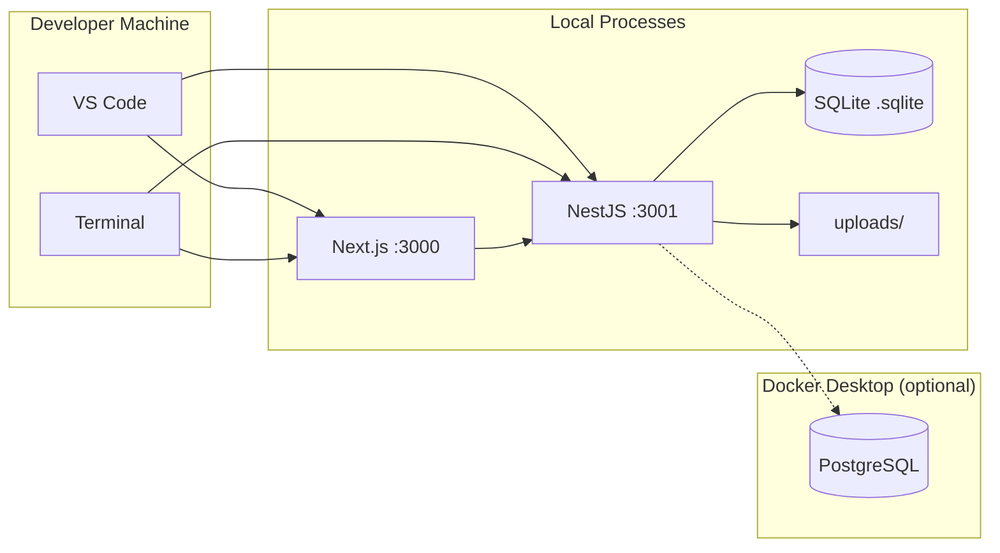

### 10.2 Production Architecture

```mermaid
graph TB
    subgraph "DNS"
        DNS[DNS: platform.example.com]
    end

    subgraph "CDN"
        CDN[Vercel CDN<br/>Static assets]
    end

    subgraph "Load Balancer"
        LB[Nginx / Traefik<br/>SSL Termination<br/>Reverse Proxy]
    end

    subgraph "Docker Host"
        FE[Frontend Container<br/>Next.js :3000]
        BE[Backend Container<br/>NestJS :3001]
    end

    subgraph "PostgreSQL"
        PG[(Primary DB :5432)]
        PG_REPL[(Replica :5433<br/>Future)]
    end

    subgraph "Storage"
        S3[AWS S3 Bucket<br/>File Attachments]
    end

    subgraph "Observability"
        LOG[File Logs → stdout]
        MONIT[Health Check<br/>:3001/api/v1/health]
    end

    DNS --> CDN
    CDN --> LB
    DNS --> LB
    LB --> FE
    LB --> BE
    FE --> BE
    BE --> PG
    BE --> S3
    BE --> LOG
    MONIT --> BE
```

### 10.3 Docker Compose (Production)

```yaml
version: '3.9'

services:
  frontend:
    build:
      context: ./apps/frontend
      dockerfile: Dockerfile
    ports:
      - "3000:3000"
    environment:
      - NEXT_PUBLIC_API_URL=http://backend:3001/api/v1
      - NODE_ENV=production
    depends_on:
      - backend
    restart: unless-stopped

  backend:
    build:
      context: ./apps/backend
      dockerfile: Dockerfile
    ports:
      - "3001:3001"
    environment:
      - NODE_ENV=production
      - DB_TYPE=postgres
      - DB_HOST=postgres
      - DB_PORT=5432
      - DB_USERNAME=${DB_USERNAME}
      - DB_PASSWORD=${DB_PASSWORD}
      - DB_NAME=${DB_NAME}
      - JWT_SECRET=${JWT_SECRET}
      - JWT_REFRESH_SECRET=${JWT_REFRESH_SECRET}
      - FRONTEND_URL=http://frontend:3000
      - STORAGE_TYPE=s3
      - AWS_ACCESS_KEY_ID=${AWS_ACCESS_KEY_ID}
      - AWS_SECRET_ACCESS_KEY=${AWS_SECRET_ACCESS_KEY}
      - AWS_REGION=${AWS_REGION}
      - AWS_S3_BUCKET=${AWS_S3_BUCKET}
    depends_on:
      postgres:
        condition: service_healthy
    restart: unless-stopped

  postgres:
    image: postgres:16-alpine
    ports:
      - "5432:5432"
    environment:
      - POSTGRES_DB=${DB_NAME}
      - POSTGRES_USER=${DB_USERNAME}
      - POSTGRES_PASSWORD=${DB_PASSWORD}
    volumes:
      - pgdata:/var/lib/postgresql/data
    healthcheck:
      test: ["CMD-SHELL", "pg_isready -U ${DB_USERNAME}"]
      interval: 5s
      timeout: 5s
      retries: 5
    restart: unless-stopped

  nginx:
    image: nginx:alpine
    ports:
      - "80:80"
      - "443:443"
    volumes:
      - ./nginx.conf:/etc/nginx/nginx.conf
      - ./ssl:/etc/nginx/ssl
    depends_on:
      - frontend
      - backend
    restart: unless-stopped

volumes:
  pgdata:
```

### 10.4 CI/CD Pipeline (GitHub Actions)

```yaml
name: CI/CD Pipeline

on:
  push:
    branches: [main, develop]
  pull_request:
    branches: [main]

jobs:
  lint:
    runs-on: ubuntu-latest
    steps:
      - uses: actions/checkout@v4
      - uses: actions/setup-node@v4
        with:
          node-version: 18
          cache: 'npm'
      - run: npm ci
      - run: npm run lint --workspaces

  typecheck:
    runs-on: ubuntu-latest
    steps:
      - uses: actions/checkout@v4
      - uses: actions/setup-node@v4
        with:
          node-version: 18
          cache: 'npm'
      - run: npm ci
      - run: npx tsc --noEmit --workspace apps/backend
      - run: npx tsc --noEmit --workspace apps/frontend

  test:
    runs-on: ubuntu-latest
    steps:
      - uses: actions/checkout@v4
      - uses: actions/setup-node@v4
        with:
          node-version: 18
          cache: 'npm'
      - run: npm ci
      - run: npm test --workspaces

  build:
    runs-on: ubuntu-latest
    needs: [lint, typecheck, test]
    steps:
      - uses: actions/checkout@v4
      - uses: actions/setup-node@v4
        with:
          node-version: 18
          cache: 'npm'
      - run: npm ci
      - run: npm run build --workspace apps/backend
      - run: npm run build --workspace apps/frontend

  deploy:
    runs-on: ubuntu-latest
    needs: [build]
    if: github.ref == 'refs/heads/main'
    steps:
      - name: Deploy to VPS
        uses: appleboy/ssh-action@v1.0.0
        with:
          host: ${{ secrets.DEPLOY_HOST }}
          username: ${{ secrets.DEPLOY_USER }}
          key: ${{ secrets.DEPLOY_KEY }}
          script: |
            cd /opt/specialist-platform
            git pull
            docker compose pull
            docker compose up -d --build
            docker system prune -f
```

---

## 11. Observability

### 11.1 Logging Strategy

```
Format: JSON structured logging

Levels:
  ERROR   → Catastrophic / Unhandled exceptions (GlobalExceptionFilter)
  WARN    → Business rule violations, 4xx errors
  INFO    → Login/logout, CRUD operations, audit trail
  DEBUG   → Development only (disabled in production)
  VERBOSE → SQL queries (DB_LOGGING=true)

Log Sources:
  1. NestJS Logger:    Request/response lifecycle
  2. GlobalExceptionFilter: All unhandled exceptions
  3. AuditLog entity: All user actions (persistent)
  4. HTTP Logging:     Morgan / NestJS built-in (future)
```

### 11.2 Key Metrics

```typescript
// Health endpoint response
{
  "status": "ok",
  "timestamp": "2026-03-07T20:00:00.000Z",
  "uptime": 3600,          // seconds
  "version": "1.0.0",
  "services": {
    "database": {
      "status": "ok",
      "latency": 5           // ms
    },
    "memory": {
      "used": 256,           // MB
      "total": 1024          // MB
    }
  }
}
```

### 11.3 Monitoring Checklist

| Metric | Implementation | Alert Threshold |
|--------|---------------|-----------------|
| CPU Usage | `os.loadavg()` / Docker stats | >80% for 5min |
| Memory Usage | `process.memoryUsage()` | >500MB RSS |
| Disk Usage | `check-disk-space` (future) | >90% |
| API Response Time | Custom middleware (future) | p95 > 500ms |
| Error Rate | GlobalExceptionFilter stats | >1% of requests |
| 5xx Errors | Filter logs | >0 in 5min |
| Active Users | Auth login count | N/A |
| DB Connections | TypeORM pool stats | >80% pool |


## 12. Testing Strategy

### 12.1 Test Pyramid

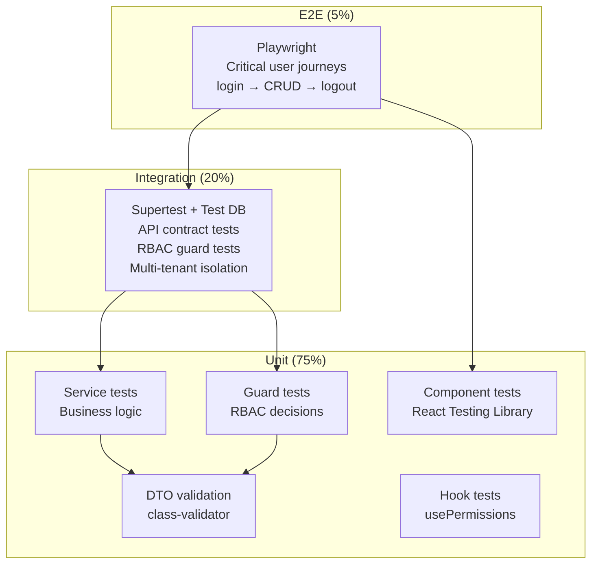

### 12.2 Current Test Coverage

```typescript
// Backend: limited test files found
src/common/decorators/__tests__/decorators.spec.ts
src/common/guards/__tests__/jwt-auth.guard.spec.ts
src/common/permissions/__tests__/role-permissions.spec.ts
src/modules/health/__tests__/health.service.spec.ts

// Frontend: no test files found

// Priority for adding tests:
// 1. RBAC role-permissions matrix (critical for security)
// 2. Auth service (login/refresh/profile)
// 3. Guards (TenantGuard, RbacGuard)
// 4. API endpoints (critical paths)
// 5. Frontend hooks (usePermissions, useRouteGuard)
```

### 12.3 Critical Test Scenarios

```typescript
// === RBAC Tests ===
describe('RBAC - roleHasPermission', () => {
  it('super_admin has ALL permissions', () => {
    Object.values(Permission).forEach(p =>
      expect(roleHasPermission('super_admin', p)).toBe(true)
    );
  });
  it('beneficiary cannot view other beneficiaries', () => {
    expect(roleHasPermission('beneficiary', Permission.BENEFICIARY_VIEW_ALL)).toBe(false);
  });
  it('accountant has payment permissions', () => {
    expect(roleHasPermission('accountant', Permission.PAYMENT_VIEW)).toBe(true);
  });
});

// === Multi-Tenant Tests ===
describe('TenantGuard - isolation', () => {
  it('tenant A cannot access tenant B data');
  it('super admin can access all tenants');
  it('unauthenticated request is rejected');
});

// === Auth Tests ===
describe('Auth - login', () => {
  it('returns tokens + user on valid credentials');
  it('rejects inactive user');
  it('rejects wrong password');
  it('rate limits after 5 failed attempts');
});
```

---

## 13. Scalability & Performance

### 13.1 Current Performance Profile

```
Database:
  Total entities:  14 tables
  Max rows/table:  ~10K (current scale)
  Query time:      <10ms (indexed queries)
  JSON columns:    5 tables (flexible schema)

API:
  Average latency:  ~50-100ms (dev)
  Endpoints:        86+
  Rate limit:       100 req/60s global

Frontend:
  Bundle size:      ~400KB JS
  API calls/page:   1-5 (React Query caching)
  Re-renders:       Minimal (Zustand selectors)
```

### 13.2 Scaling Strategy

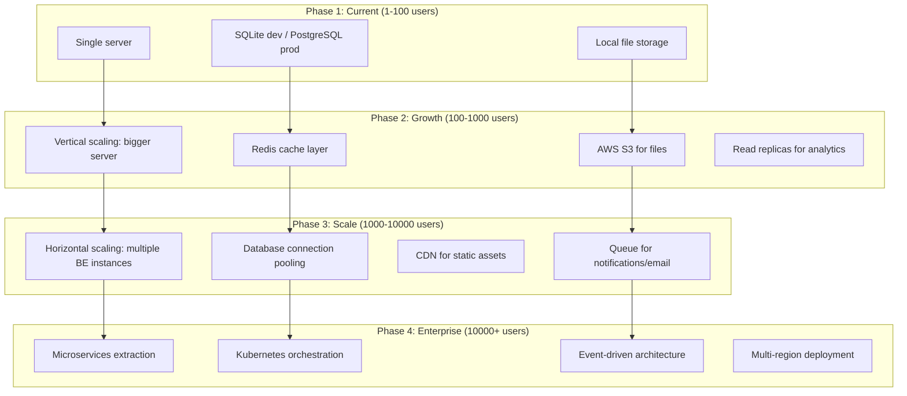

### 13.3 Performance Optimizations (Priority Order)

| Priority | Optimization | Impact | Effort |
|----------|-------------|--------|--------|
| 1 | React Query staleTime (5min) | 🟢 High | 🟢 Low |
| 2 | Database indexes (all FK + status + date) | 🟢 High | 🟢 Low |
| 3 | N+1 query prevention (TypeORM relations) | 🟢 High | 🟡 Medium |
| 4 | API response pagination (24/page default) | 🟢 High | 🟢 Low |
| 5 | Axios request/response interceptors | 🟡 Medium | 🟢 Low |
| 6 | Server-side compression (compression()) | 🟡 Medium | 🟢 Low |
| 7 | Lazy loading route components (Next.js) | 🟡 Medium | 🟢 Low |
| 8 | Image optimization (Next/Image) | 🟡 Medium | 🟡 Medium |
| 9 | Database connection pooling (pg-pool) | 🟡 Medium | 🟡 Medium |
| 10 | Redis cache for frequent queries | 🔴 Low | 🔴 High |

---

## 14. ADR Log

### ADR-001: Modular Monolith over Microservices

**Context:** Need to choose between monolithic and microservice architecture. **Decision:** Start with a modular monolith (NestJS modules with clear boundaries). **Rationale:** Team size (1-3 devs), no need for independent scaling yet, simpler deployment, faster development. Future extraction to microservices is possible because modules already have clear boundaries.

### ADR-002: Shared-Database Multi-Tenancy over Schema-Per-Tenant

**Context:** Need multi-tenant isolation. **Decision:** Shared database with `tenantId` discriminator column on every entity. **Rationale:** Cheapest operational cost, single schema to manage, easier migrations, sufficient for <1000 tenants. `TenantGuard` ensures query-level isolation.

### ADR-003: Zustand + React Query over Redux

**Context:** State management approach. **Decision:** Zustand for client state (auth), TanStack React Query for server state (API data). **Rationale:** Clear separation of concerns, no boilerplate, built-in caching/dedup/retry from React Query, Zustand's simplicity for the small amount of client state needed.

### ADR-004: 48 Granular Permissions over Simple Role Checks

**Context:** Authorization model. **Decision:** Fine-grained permission matrix with 48 permissions across 7 roles, enforced at both backend and frontend. **Rationale:** Allows precise control (e.g., "view reports" vs "approve reports"), enables future custom role creation, consistent across stack.

### ADR-005: Client-Side Rendering over SSR

**Context:** Rendering strategy for dashboard pages. **Decision:** All dashboard pages use `'use client'` (CSR). **Rationale:** Dashboard is authenticated-only, no SEO needed, simpler development, faster subsequent navigation. Server-side rendering reserved for future public-facing pages.

### ADR-006: Custom i18n Context over next-intl

**Context:** Internationalization library. **Decision:** Custom React Context wrapping JSON message files. **Rationale:** Only 2 languages (AR/EN), simple key-value structure, no need for ICU message syntax, full reload on language switch avoids edge cases with RTL/LTR transitions.

---

## Appendix A: File Map

```
specialist-platform/
├── SYSTEM_DESIGN.md                           ← This document
│
├── apps/
│   ├── backend/
│   │   ├── src/
│   │   │   ├── main.ts                        ← App bootstrap
│   │   │   ├── app.module.ts                  ← Root module
│   │   │   │
│   │   │   ├── common/
│   │   │   │   ├── decorators/index.ts        ← @Public, @AdminOnly, @WriterOnly, etc.
│   │   │   │   ├── filters/global-exception.filter.ts
│   │   │   │   ├── guards/
│   │   │   │   │   ├── jwt-auth.guard.ts
│   │   │   │   │   ├── tenant.guard.ts
│   │   │   │   │   ├── rbac.guard.ts
│   │   │   │   │   ├── roles.guard.ts
│   │   │   │   │   └── permission.guard.ts
│   │   │   │   ├── interceptors/response.interceptor.ts
│   │   │   │   ├── middleware/rbac.middleware.ts  ← Disabled (replaced by guard)
│   │   │   │   └── permissions/
│   │   │   │       ├── permissions.enum.ts        ← 48 permission values
│   │   │   │       └── role-permissions.ts        ← Role ↔ Permission matrix
│   │   │   │
│   │   │   ├── config/configuration.ts
│   │   │   ├── database/abstract.entity.ts
│   │   │   │
│   │   │   └── modules/
│   │   │       ├── auth/          → 8 endpoints
│   │   │       ├── users/         → 6 endpoints
│   │   │       ├── tenants/       → 7 endpoints
│   │   │       ├── beneficiaries/ → 12 endpoints
│   │   │       ├── appointments/  → 11 endpoints
│   │   │       ├── sessions/      → 5 endpoints
│   │   │       ├── reports/       → 9 endpoints
│   │   │       ├── payments/      → 14 endpoints
│   │   │       ├── files/         → 4 endpoints
│   │   │       ├── notifications/ → 4 endpoints
│   │   │       ├── analytics/     → 4 endpoints
│   │   │       ├── search/        → 2 endpoints
│   │   │       ├── audit-log/     → 1 endpoint
│   │   │       └── health/        → 1 endpoint
│   │   │
│   │   ├── data/                              ← SQLite database (dev)
│   │   ├── uploads/                           ← File uploads (dev)
│   │   └── .env
│   │
│   └── frontend/
│       └── src/
│           ├── app/
│           │   ├── globals.css                ← Design tokens + Tailwind
│           │   ├── layout.tsx                 ← Root layout
│           │   ├── page.tsx                   ← Redirect → /auth/login
│           │   ├── auth/                      ← 4 pages
│           │   └── dashboard/
│           │       ├── layout.tsx             ← Sidebar + Header + i18n
│           │       ├── page.tsx               ← KPI dashboard
│           │       ├── loading.tsx / error.tsx
│           │       ├── beneficiaries/         ← 4 pages
│           │       ├── appointments/          ← 3 pages
│           │       ├── reports/               ← 3 pages
│           │       ├── payments/              ← 5 pages
│           │       ├── sessions/
│           │       ├── files/
│           │       ├── users/                 ← 2 pages
│           │       ├── specialists/
│           │       ├── analytics/
│           │       ├── search/
│           │       ├── notifications/
│           │       ├── audit/
│           │       ├── profile/
│           │       └── settings/
│           │
│           ├── components/
│           │   ├── auth/                      ← PermissionGate, RouteGuard
│           │   ├── ui/                        ← Button, Card, Input, Modal, etc.
│           │   ├── shared/                    ← GlobalSearch
│           │   ├── beneficiaries/             ← BeneficiaryCard, GoalsSection
│           │   ├── appointments/              ← AppointmentCard
│           │   ├── calendar/                  ← InteractiveCalendar
│           │   ├── reports/                   ← ReportCard, FileUploader, FilesList
│           │   └── payments/                  ← InvoiceCard, SubscriptionCard
│           │
│           ├── hooks/                         ← useApi, usePermissions, useTheme
│           ├── lib/                           ← ApiClient, Utils, ThemeService, i18n
│           ├── services/                      ← 8 API service files
│           ├── store/                         ← AuthStore (Zustand)
│           ├── styles/                        ← decorative.css
│           ├── types/                         ← All TS interfaces + constants
│           └── messages/                      ← ar.json, en.json
│
├── package.json                              ← Workspace root
├── turbo.json                                ← Turborepo config
└── README.md
```

## Appendix B: Quick Reference

```bash
# ── Development ──────────────────────────────────────
npm run dev           # Start both frontend + backend (turbo)
npm run dev:backend   # Backend only (nest start --watch)
npm run dev:frontend  # Frontend only (next dev)

# ── Build ────────────────────────────────────────────
npm run build         # Build both apps
npm run build:backend # Backend only
npm run build:frontend# Frontend only

# ── Type Checking ────────────────────────────────────
npx tsc --noEmit --workspace apps/backend
npx tsc --noEmit --workspace apps/frontend

# ── Testing ──────────────────────────────────────────
npm test              # Run all tests
npm run test:e2e      # E2E tests (backend)

# ── Linting ───────────────────────────────────────────
npm run lint          # ESLint + Prettier check

# ── Database ──────────────────────────────────────────
npm run migration:run     # TypeORM migrations (future)
npm run migration:revert  # Revert last migration

# ── Production ────────────────────────────────────────
docker compose up -d  # Full stack with PostgreSQL

# ── Access ────────────────────────────────────────────
Frontend:  http://localhost:3000
Backend:   http://localhost:3001/api/v1
Swagger:   http://localhost:3001/api/docs
```
